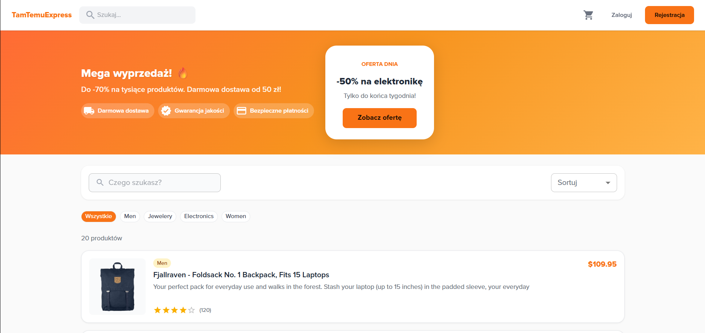
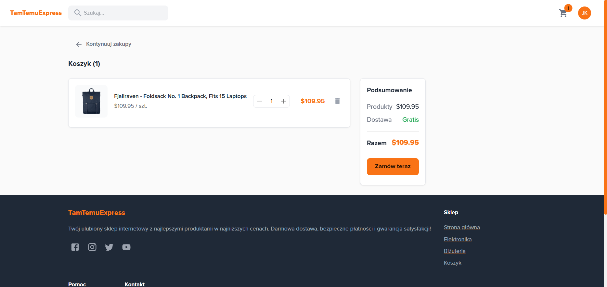
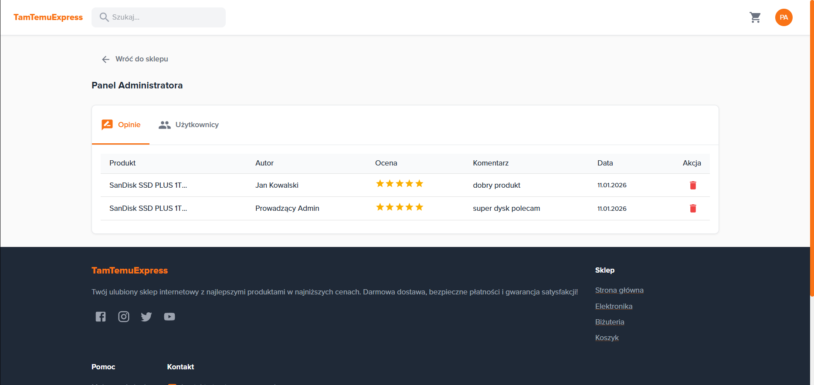
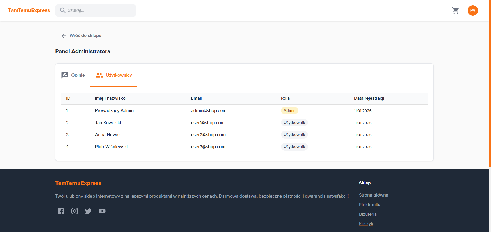

# TamTemuExpress - Sklep Internetowy

Nowoczesny sklep internetowy inspirowany platformą Temu, zbudowany z użyciem React, Material UI i Express.js.

---

## Spis treści

1. [O projekcie](#-o-projekcie)
2. [Zrzuty ekranu](#-zrzuty-ekranu)
3. [Funkcjonalności](#-funkcjonalności)
4. [Technologie](#️-technologie)
5. [Architektura](#-architektura)
6. [Instalacja](#-instalacja)
7. [Uruchomienie](#-uruchomienie)
8. [Konta testowe](#-konta-testowe)
9. [API Endpoints](#-api-endpoints)
10. [Struktura projektu](#-struktura-projektu)
11. [Autorzy](#-autorzy)

---

## O projekcie

**TamTemuExpress** to w pełni funkcjonalny sklep internetowy oferujący:

- **Intuicyjny interfejs użytkownika** - responsywny design z nowoczesnym wyglądem
- **System uwierzytelniania** - bezpieczna rejestracja i logowanie z tokenami JWT
- **Pełny proces zakupowy** - od przeglądania produktów po finalizację zamówienia
- **System opinii** - użytkownicy mogą oceniać i komentować produkty
- **Panel administracyjny** - zarządzanie opiniami i przeglądanie użytkowników

### Główne cechy:
- **Nowoczesny design** - pomarańczowy motyw kolorystyczny, czcionka Proxima Nova
- **Responsywność** - działa na komputerach, tabletach i telefonach
- **Szybkość** - zbudowany z Vite dla błyskawicznego ładowania
- **Bezpieczeństwo** - JWT z refresh tokenami, hashowanie haseł bcrypt

---

## Zrzuty ekranu

### Strona główna
Prezentacja produktów w formie listy z wyszukiwarką i filtrami kategorii.



### Strona produktu
Szczegółowy widok produktu z galerią, opisem, ceną i sekcją opinii.


### Koszyk zakupowy
Podgląd wybranych produktów z możliwością zmiany ilości i finalizacji zamówienia.



### Panel administratora
Zarządzanie opiniami użytkowników i podgląd listy zarejestrowanych użytkowników.





---

## Funkcjonalności

### Dla wszystkich użytkowników (niezalogowanych):

| Funkcja | Opis |
|---------|------|
| **Strona główna** | Przeglądanie listy wszystkich produktów z promocyjnym banerem |
| **Wyszukiwarka** | Wyszukiwanie produktów po nazwie w czasie rzeczywistym |
| **Filtrowanie** | Filtrowanie produktów według kategorii (elektronika, biżuteria, odzież) |
| **Strona produktu** | Szczegółowy widok z opisem, ceną, oceną i opiniami |
| **Przeglądanie opinii** | Podgląd wszystkich opinii o produkcie |
| **Sortowanie** | Sortowanie produktów po cenie, ocenie lub nazwie |

### Dla zalogowanych użytkowników:

| Funkcja | Opis |
|---------|------|
| **Koszyk zakupowy** | Dodawanie/usuwanie produktów, zmiana ilości |
| **Składanie zamówień** | Finalizacja zakupu z podsumowaniem |
| **Historia zamówień** | Lista wszystkich złożonych zamówień |
| **Szczegóły zamówienia** | Podgląd szczegółów wybranego zamówienia |
| **Dodawanie opinii** | Możliwość wystawienia 1 opinii na produkt (1-5 gwiazdek + komentarz) |
| **Edycja opinii** | Modyfikacja wcześniej dodanych opinii |
| **Usuwanie opinii** | Usuwanie własnych opinii |

### Dla administratorów:

| Funkcja | Opis |
|---------|------|
| **Panel administratora** | Dostęp do panelu zarządzania |
| **Podgląd wszystkich opinii** | Lista wszystkich opinii w systemie |
| **Usuwanie opinii** | Możliwość usunięcia dowolnej opinii |
| **Lista użytkowników** | Podgląd wszystkich zarejestrowanych użytkowników |

### Bezpieczeństwo:

- **JWT Authentication** - tokeny dostępu z czasem ważności 15 minut
- **Refresh Token** - automatyczne odświeżanie sesji (ważność 7 dni)
- **Hashowanie haseł** - bcrypt z salt rounds
- **Protected Routes** - automatyczne przekierowanie nieautoryzowanych użytkowników
- **Walidacja danych** - walidacja po stronie klienta i serwera

---

## Technologie

### Frontend

| Technologia | Wersja | Opis zastosowania |
|-------------|--------|-------------------|
| **React** | 18.x | Biblioteka do budowy interfejsu użytkownika |
| **Vite** | 5.x | Narzędzie do szybkiego budowania i hot-reload |
| **Material UI** | 5.x | Gotowe komponenty UI zgodne z Material Design |
| **React Router** | 6.x | Routing i nawigacja w aplikacji SPA |
| **Axios** | 1.x | Klient HTTP do komunikacji z API |
| **Context API** | - | Zarządzanie globalnym stanem (Auth, Cart) |

### Backend

| Technologia | Wersja | Opis zastosowania |
|-------------|--------|-------------------|
| **Node.js** | 18.x | Środowisko uruchomieniowe JavaScript |
| **Express.js** | 5.x | Framework do tworzenia REST API |
| **SQLite** | 3.x | Lekka baza danych SQL |
| **JSON Web Token** | 9.x | Generowanie i weryfikacja tokenów JWT |
| **bcryptjs** | 2.x | Hashowanie i weryfikacja haseł |
| **cors** | 2.x | Obsługa Cross-Origin Resource Sharing |

---

## Architektura

```
┌─────────────────────────────────────────────────────────────────┐
│                         FRONTEND (React)                         │
│  ┌─────────────┐  ┌─────────────┐  ┌─────────────────────────┐  │
│  │   Pages     │  │ Components  │  │       Context           │  │
│  │ (HomePage,  │  │ (Header,    │  │ (AuthContext,           │  │
│  │  CartPage,  │  │  Footer,    │  │  CartContext)           │  │
│  │  etc.)      │  │  etc.)      │  │                         │  │
│  └─────────────┘  └─────────────┘  └─────────────────────────┘  │
│                            │                                     │
│                    ┌───────▼───────┐                            │
│                    │  API Service  │ (Axios + Interceptors)     │
│                    └───────────────┘                            │
└────────────────────────────┬────────────────────────────────────┘
                             │ HTTP (REST API)
                             ▼
┌─────────────────────────────────────────────────────────────────┐
│                        BACKEND (Express.js)                      │
│  ┌─────────────┐  ┌─────────────┐  ┌─────────────────────────┐  │
│  │  Routes     │  │ Middleware  │  │      Database           │  │
│  │ (auth,      │  │ (JWT auth,  │  │      (SQLite)           │  │
│  │  products,  │  │  CORS)      │  │  ┌─────────────────┐    │  │
│  │  cart,      │  │             │  │  │ users           │    │  │
│  │  orders,    │  │             │  │  │ products        │    │  │
│  │  reviews)   │  │             │  │  │ reviews         │    │  │
│  │             │  │             │  │  │ cart_items      │    │  │
│  │             │  │             │  │  │ orders          │    │  │
│  └─────────────┘  └─────────────┘  │  │ order_items     │    │  │
│                                    │  └─────────────────┘    │  │
│                                    └─────────────────────────┘  │
└─────────────────────────────────────────────────────────────────┘
```

---

## Instalacja

### Wymagania systemowe

- **Node.js** >= 18.0.0
- **npm** >= 9.0.0

### Krok 1: Klonowanie repozytorium

```bash
git clone https://github.com/migrabos/WDAI-Project.git
cd WDAI-Project
```

### Krok 2: Instalacja zależności backendu

```bash
cd server
npm install
```

### Krok 3: Instalacja zależności frontendu

```bash
cd ../client
npm install
```

---

## Uruchomienie

### Uruchomienie serwera (backend)

```bash
cd server
npm start
```

Serwer uruchomi się na: **http://localhost:3001**

### Uruchomienie aplikacji (frontend)

W osobnym terminalu:

```bash
cd client
npm run dev
```

Aplikacja uruchomi się na: **http://localhost:5173**

---

## Konta testowe

Aplikacja posiada wstępnie utworzone konta do testowania:

### Konto administratora

| Email | Hasło | Uprawnienia |
|-------|-------|-------------|
| `admin@shop.com` | `admin123` | Pełny dostęp + panel admina |

### Konta użytkowników

| Email | Hasło | Opis |
|-------|-------|------|
| `user1@shop.com` | `user123` | Testowy użytkownik 1 |
| `user2@shop.com` | `user123` | Testowy użytkownik 2 |
| `user3@shop.com` | `user123` | Testowy użytkownik 3 |

---

## API Endpoints

### Autoryzacja (`/api/auth`)

| Metoda | Endpoint | Opis | Auth |
|--------|----------|------|------|
| `POST` | `/register` | Rejestracja nowego użytkownika | ❌ |
| `POST` | `/login` | Logowanie, zwraca tokeny | ❌ |
| `POST` | `/refresh` | Odświeżenie access tokena | ❌ |
| `POST` | `/logout` | Wylogowanie | ✅ |
| `GET` | `/me` | Dane zalogowanego użytkownika | ✅ |

### Produkty (`/api/products`)

| Metoda | Endpoint | Opis | Auth |
|--------|----------|------|------|
| `GET` | `/` | Lista wszystkich produktów | ❌ |
| `GET` | `/:id` | Szczegóły pojedynczego produktu | ❌ |
| `GET` | `/categories` | Lista dostępnych kategorii | ❌ |

### Opinie (`/api/reviews`)

| Metoda | Endpoint | Opis | Auth |
|--------|----------|------|------|
| `GET` | `/product/:id` | Opinie o produkcie | ❌ |
| `POST` | `/` | Dodaj nową opinię | ✅ |
| `PUT` | `/:id` | Edytuj opinię | ✅ |
| `DELETE` | `/:id` | Usuń opinię | ✅ |

### Koszyk (`/api/cart`)

| Metoda | Endpoint | Opis | Auth |
|--------|----------|------|------|
| `GET` | `/` | Pobierz zawartość koszyka | ✅ |
| `POST` | `/` | Dodaj produkt do koszyka | ✅ |
| `PUT` | `/:id` | Zmień ilość produktu | ✅ |
| `DELETE` | `/:id` | Usuń produkt z koszyka | ✅ |
| `DELETE` | `/` | Wyczyść cały koszyk | ✅ |

### Zamówienia (`/api/orders`)

| Metoda | Endpoint | Opis | Auth |
|--------|----------|------|------|
| `GET` | `/` | Historia zamówień użytkownika | ✅ |
| `GET` | `/:id` | Szczegóły zamówienia | ✅ |
| `POST` | `/` | Złóż nowe zamówienie | ✅ |

### Panel admina (`/api/admin`)

| Metoda | Endpoint | Opis | Auth |
|--------|----------|------|------|
| `GET` | `/reviews` | Wszystkie opinie w systemie | ✅ (admin) |
| `GET` | `/users` | Lista wszystkich użytkowników | ✅ (admin) |

---

## Struktura projektu

```
WDAI-Project/
├── client/                             # Frontend (React + Vite)
│   ├── public/                         # Pliki statyczne
│   │   └── favicon.svg                 # Ikona strony
│   ├── src/
│   │   ├── components/                 # Komponenty wielokrotnego użytku
│   │   │   ├── Header.jsx              # Nawigacja górna
│   │   │   ├── Footer.jsx              # Stopka strony
│   │   │   ├── Layout.jsx              # Layout wrapper
│   │   │   ├── ProductCard.jsx         # Karta produktu (grid)
│   │   │   ├── ProductListItem.jsx     # Element listy produktów
│   │   │   └── ProtectedRoute.jsx      # Ochrona tras
│   │   ├── context/                    # React Context (globalny stan)
│   │   │   ├── AuthContext.jsx         # Stan autoryzacji
│   │   │   └── CartContext.jsx         # Stan koszyka
│   │   ├── pages/                      # Strony aplikacji
│   │   │   ├── HomePage.jsx            # Strona główna
│   │   │   ├── ProductDetailPage.jsx   # Szczegóły produktu
│   │   │   ├── CartPage.jsx            # Koszyk
│   │   │   ├── LoginPage.jsx           # Logowanie
│   │   │   ├── RegisterPage.jsx        # Rejestracja
│   │   │   ├── OrderHistoryPage.jsx    # Historia zamówień
│   │   │   ├── OrderDetailPage.jsx     # Szczegóły zamówienia
│   │   │   └── AdminPage.jsx           # Panel admina
│   │   ├── services/                   # Warstwa API
│   │   │   └── api.js                  # Axios instance + interceptors
│   │   ├── App.jsx                     # Główny komponent + routing
│   │   ├── main.jsx                    # Entry point
│   │   ├── theme.js                    # Konfiguracja MUI theme
│   │   └── index.css                   # Globalne style CSS
│   ├── index.html                      # HTML template
│   ├── vite.config.js                  # Konfiguracja Vite
│   └── package.json                    # Zależności frontend
│
├── server/                             # Backend (Express.js)
│   ├── database/                       # Pliki bazy SQLite
│   │   └── shop.db                     # Baza danych
│   ├── index.js                        # Główny plik serwera
│   ├── database.js                     # Konfiguracja SQLite
│   └── package.json                    # Zależności backend
│
├── docs/                               # Dokumentacja
│   └── API.md                          # Dokumentacja API
│
├── postman/                            # Kolekcja Postman
│   └── TamTemuExpress.postman_collection.json
│
└── README.md                           # Ten plik
```

---

## Autorzy

| Imię i Nazwisko | GitHub |
|-----------------|--------|
| **Michał Graboś** | [@migrabos](https://github.com/migrabos) |
| **Patryk Ledziński** | [@Patryk-Ledzinski](https://github.com/Patryk-Ledzinski) |

---

## Licencja

Projekt został stworzony w celach edukacyjnych na potrzeby przedmiotu **WDAI (Wprowadzenie do Aplikacji Internetowych)** na Akademii Górniczo-Hutniczej w Krakowie.

---
